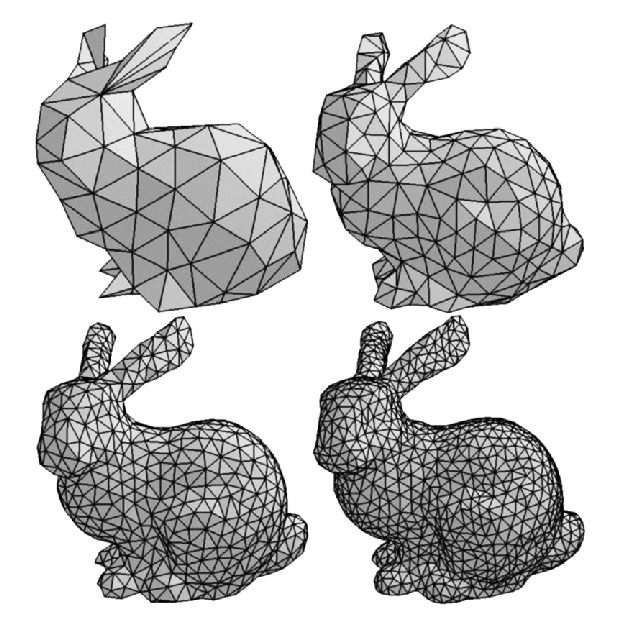

# MeshNet: Mesh Neural Network for 3D Shape Representation


## Requirements
You could install the required package as follows. This code has been tested with Python 3.8 and CUDA 11.1.
```
pip install -r requirements.txt
```

## Task

Classifying 3D objects into 10 classes(or 40 depending on dataset used). MeshData is received and corresponding class is the output.

## Dataset

Dataset [ModelNet10](http://modelnet.cs.princeton.edu/) and [ModelNet40](http://modelnet.cs.princeton.edu/) are both public and easily available.

### Data Preparation

MeshNet requires the pre-processed ModelNet40 with simplified and re-organized mesh data. To quickly start training, we recommend to use pre-processed ModelNet40 dataset: `ModelNet40_processed`

### Data Format

The details of our pre-processing are as follows: The original dataset are from [ModelNet](http://modelnet.cs.princeton.edu/). Firstly, we simplify the mesh models with no more than `max_faces` faces. We now recommend to use the Manifold40 version with watertight mesh and `max_faces=500`. Then we reorganize the dataset to the format required by MeshNet and store it into `XXX.npz`. The reorganized file includes two parts of data:
- The "faces" part contains the center position, vertices' positions and normal vector of each face.
- The "neighbors" part contains the indices of neighbors of each face.

If you wish to create and use your own dataset, simplify your models into `.obj` format and use the code in `data/preprocess.py` to transform them into the required `.npz` format. Notice that the parameter `max_faces` in config files should be maximum number of faces among all of your simplified mesh models. 

## Evaluation
The pretrained MeshNet model weights are stored in [pretrained model](https://cloud.tsinghua.edu.cn/f/33bfdc6f103340daa86a/?dl=1). You can download it and configure the "load_model" in `config/test_config.yaml` with your path to the weight file. Then run the test script.
```
python test.py
```

## Training

To train and evaluate MeshNet for classification and retrieval:

```bash
python train.py
```

You can modify the configuration in the `config/train_config.yaml` for your own training, including the CUDA devices to use, the flag of data augmentation and the hyper-parameters of MeshNet.

